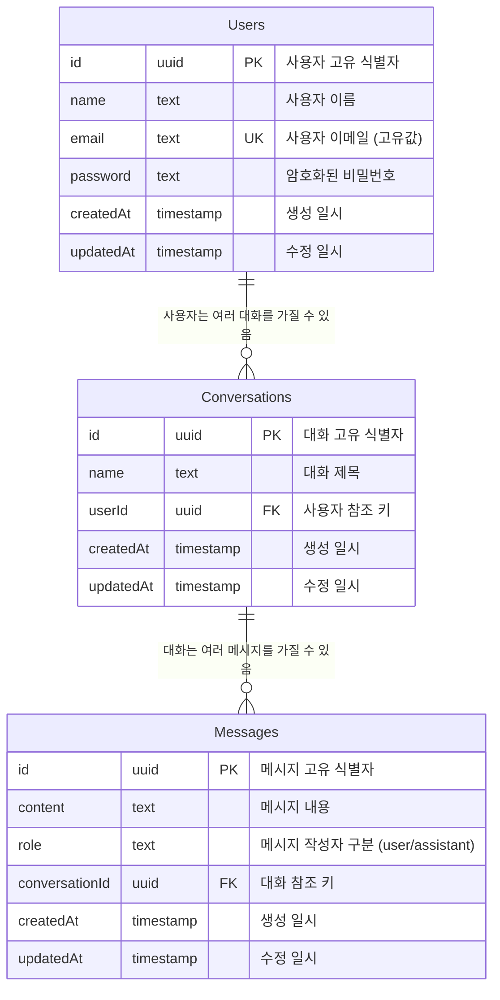

# 제품 요구사항 문서 (PRD)

## 1. 프로젝트 개요

### 1.1 프로젝트명

Clone-ChatGPT

### 1.2 목적과 목표

#### 비즈니스 목표

- ChatGPT와 유사한 대화형 AI 플랫폼 구현
- 사용자 친화적인 인터페이스 제공
- 안전하고 신뢰성 있는 서비스 제공

#### 제품 목표

- AI 모델을 활용한 자연스러운 대화 기능 구현
- 사용자별 대화 기록 관리 및 보존
- 반응형 디자인을 통한 다양한 디바이스 지원

### 1.3 대상 사용자

#### 주요 타겟 사용자층

- 연령대: 전 연령층
- 직업군: AI 챗봇 서비스 사용이 필요한 모든 사용자
- 사용 환경: 웹 브라우저 (데스크톱/모바일)

## 2. 기술적 요구사항

### 2.1 기술 스택

#### 프론트엔드

- 프레임워크: Next.js
- 언어: TypeScript
- UI 라이브러리:
  - Tailwind CSS
  - shadcn/ui
- 상태관리: Zustand

#### 백엔드

- 프레임워크: Next.js (App Router)
- 데이터베이스: PostgreSQL (Neon)
- ORM: Drizzle ORM
- API: Server Actions

### 2.2 시스템 아키텍처

#### 인프라

- 클라우드 서비스: Vercel
- 데이터베이스: Neon PostgreSQL
- 배포 전략: Vercel CI/CD

#### 보안

- 인증/인가: 자체 세션 기반 인증
- 데이터 암호화: 비밀번호 해싱
- API 보안: Server Actions 활용

### 2.3 개발 환경

- 버전 관리: Git
- CI/CD: Vercel
- 개발 도구:
  - TypeScript
  - ESLint
  - Prettier

## 3. 기능적 요구사항

### 3.1 핵심 기능

#### 사용자 인증

- 회원가입
- 로그인/로그아웃
- 세션 관리

#### 대화 기능

- 새로운 대화 시작
- 대화 기록 저장
- 대화 목록 관리
- AI 모델 선택

#### UI/UX

- 반응형 디자인
- 다크/라이트 모드
- 사이드바 네비게이션
- 자동 크기 조절 텍스트 영역

### 3.2 데이터 모델

#### 사용자 (Users)

- id: uuid
- name: text
- email: text (unique)
- password: text
- createdAt: timestamp
- updatedAt: timestamp

#### 대화 (Conversations)

- id: uuid
- name: text
- userId: uuid (foreign key)
- createdAt: timestamp
- updatedAt: timestamp

#### 메시지 (Messages)

- id: uuid
- content: text
- role: text ('user' | 'assistant')
- conversationId: uuid (foreign key)
- createdAt: timestamp
- updatedAt: timestamp

#### 관계 정의

- 사용자 ↔ 대화: 1:N (한 사용자가 여러 대화를 가질 수 있음)
- 대화 ↔ 메시지: 1:N (한 대화가 여러 메시지를 가질 수 있음)



## 4. 비기능적 요구사항

### 4.1 성능 요구사항

- 페이지 로드 시간: 3초 이내
- API 응답 시간: 1초 이내
- 동시 접속자 처리: 100명 이상

### 4.2 보안 요구사항

#### 데이터 보안

- 사용자 비밀번호 암호화
- 세션 기반 인증
- API 엔드포인트 보호

### 4.3 확장성 요구사항

- 모듈식 컴포넌트 구조
- 데이터베이스 마이그레이션 지원
- 다국어 지원 가능 구조

## 5. 프로젝트 구조

### 5.1 디렉토리 구조

```
📦 프로젝트 루트
├── 📂 actions (서버 액션)
├── 📂 app (페이지 및 레이아웃)
├── 📂 components (UI 컴포넌트)
├── 📂 db (데이터베이스 설정)
├── 📂 hooks (커스텀 훅)
├── 📂 lib (유틸리티)
├── 📂 store (상태 관리)
└── 📂 types (타입 정의)
```

### 5.2 주요 컴포넌트

- FormCard: 인증 폼 컨테이너
- Chat: 메인 채팅 인터페이스
- SideBar: 네비게이션 사이드바
- Message: 채팅 메시지 표시
- ModelSelect: AI 모델 선택 UI

## 6. 배포 전략

### 6.1 배포 환경

- 프로덕션: Vercel
- 데이터베이스: Neon PostgreSQL

### 6.2 배포 프로세스

1. GitHub 저장소에 코드 푸시
2. Vercel 자동 빌드 및 배포
3. 데이터베이스 마이그레이션 실행

## 7. 성공 지표

### 7.1 정량적 지표

- 사용자 등록 수
- 일일 활성 사용자 수
- 평균 세션 시간

### 7.2 정성적 지표

- 사용자 피드백
- UI/UX 만족도
- 시스템 안정성
